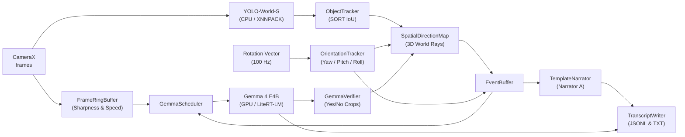

# VLM_on_mobile

An offline, on-device Android application that narrates what a phone camera sees live as running text. Built for a seated user whose phone camera rotates around them, **VLM_on_mobile** pairs real-time object detection with a local Vision-Language Model (VLM) using a **dual-narrator architecture**.

---

## Architecture Overview



Two narrators share a single event stream:
1. **Template Narrator (Narrator A):** Fast, instant narrator driven by the object detector (YOLO-World-S) and gyroscope during camera motion (*"Turning right: window, door"*).
2. **Gemma 4 E4B (Narrator B):** Vision-Language Model running on GPU via **LiteRT-LM** that generates rich, contextual scene descriptions (*"A mug sits on a stack of papers"*) when the camera settles.

---

## Core Features

* **Continuous On-Device Inference:** 100% offline, zero network dependencies, preserving user privacy.
* **Perception & Tracking:** YOLO-World-S int8 model (270 classes) on CPU via XNNPACK, combined with a SORT-style IoU tracker.
* **Spatial Direction Map:** Maps detections to 3D world rays (Azimuth, Elevation) using Camera2 lens intrinsics. Objects rotating out of view persist in `OUT_OF_VIEW` state instead of vanishing.
* **Camera Motion State Machine:** Monitors device angular speed (`MOVING` $>20^\circ/\text{s}$, `SETTLED` $<8^\circ/\text{s}$) with hysteresis.
* **Frame Ring Buffer & Selection:** Evaluates candidate frames in a 1-second ring buffer scored by low angular speed and Laplacian variance (sharpness).
* **Verification & Corrections:** Gemma performs Yes/No crop verification queries to validate or retract low-trust template claims.
* **Transcript Logging:** Appends structured JSONL events (`session-<timestamp>.jsonl`) and generates human-readable plain text transcripts (`.txt`) in app storage (`Android/data/com.example.vlm_on_mobile/files/transcripts/`).

---

## Tech Stack & Dependencies

* **Language & Framework:** Kotlin 2.2, Jetpack Compose, AndroidX.
* **Camera Pipeline:** CameraX (`camera-core`, `camera-camera2`, `camera-lifecycle`, `camera-view`).
* **VLM Engine:** LiteRT-LM (`com.google.ai.edge.litertlm:litertlm-android:0.16.1`).
* **Object Detection Engine:** TensorFlow Lite (`2.16.1`) with XNNPACK on CPU and GPU delegates.
* **Orientation Sensors:** Android `TYPE_GAME_ROTATION_VECTOR` at 100 Hz.

---

## Getting Started

### Prerequisites
* **Android Studio** (2024.1+ / Ladybug or newer)
* **JDK 17**
* **Android Device:** Android 9.0 (API level 28) or higher (e.g. Samsung Galaxy S25 / Snapdragon 8 class processor recommended for Gemma GPU execution).

### Model Setup & Deployment

1. **YOLO-World-S Model:**
   * Bundled directly inside the APK assets at `app/src/main/assets/yoloworld_s_int8_calibrated.tflite`.

2. **Gemma 4 E4B Model (~3.4 GB):**
   * Download `gemma-4-E4B-it.litertlm` from [Hugging Face LiteRT Community](https://huggingface.co/litert-community) or [Kaggle Models](https://www.kaggle.com/models/google/gemma-2).
   * Place the downloaded `.litertlm` file in `models/gemma-4-E4B-it.litertlm` on your machine.
   * Connect your Android device via USB and push the model to app storage:
     ```powershell
     powershell -ExecutionPolicy Bypass -File .\push_gemma_model.ps1
     ```

---

## Building the Project

Building debug APK:
```powershell
.\gradlew.bat assembleDebug
```

---

## Technical Design Reference

For in-depth architectural details, mathematical formulas for bearing projection, prompt structures, and thread allocation, refer to [TDD.md](file:///C:/dev/VLM_on_mobile/TDD.md).

---

## License

Copyright © 2026 Abdullah Hasan. All rights reserved.
