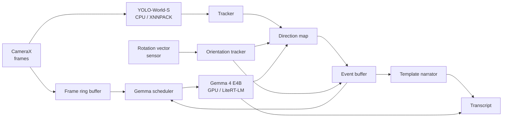
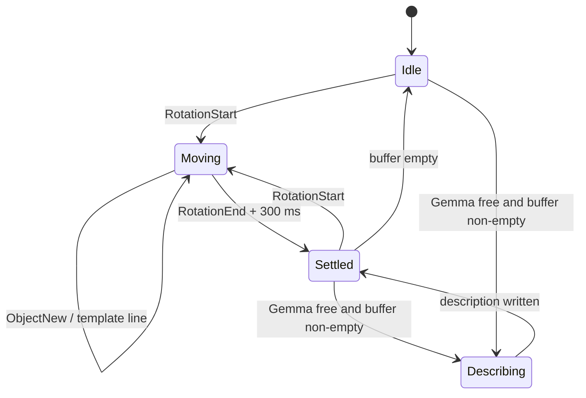

# VLM_on_mobile — Technical Design

Sep 24, 2026 · @abdullahhasan90

## Overview

An offline Android app that narrates what a phone camera sees, live, as running text. Two narrators share one event stream: a template narrator driven by the object detector and gyroscope during camera motion, and Gemma 4 E4B for considered descriptions of stable frames.

In scope:

- Continuous camera feed, on-device only, no network.
- Object detection and tracking via the existing 270-class YOLO-World-S model from openvocab\_detector.
- An object map keyed by direction around the user, built from the phone's rotation.
- Narration of camera rotation, objects entering and leaving the view, and scene description.

Out of scope for v1:

- Translation of the phone (walking, leaning). The user is seated.
- Motion of objects in the world (a person walking, a door swinging). Only camera motion is narrated.
- Audio output. Text first; text-to-speech can bolt on later.

## Constraints and assumptions

The design leans on one assumption above all: the user is seated and the phone only rotates. That removes depth estimation and makes the direction map cheap.

| Constraint | Value | Consequence |
| --- | --- | --- |
| Device | Samsung Galaxy S25 Ultra (Snapdragon 8 Elite, 12 GB RAM) | Room for two models; heat, not memory, is the limit |
| User pose | Seated, phone rotates up to \~180° on each axis | Rotation-only pose; no translation tracking |
| Connectivity | None required | All models on-device |
| Detector | YOLO-World-S, int8, 270 classes, \~12 MB | Closed vocabulary baked into the head |
| VLM | Gemma 4 E4B via LiteRT-LM, 3.65 GB | \~1–2 s per short description; must be scheduled, not polled |
| Stack | Kotlin, Jetpack Compose, CameraX, TFLite/XNNPACK | Reuse the openvocab\_detector modules |

Published Gemma 4 benchmarks are for the S26 Ultra; expect the S25 to be somewhat slower. Measure before tuning any timing constant.

## Architecture

Six components on four threads. The detector runs on CPU (XNNPACK) and Gemma on GPU, so they rarely compete for compute. They still share one thermal budget.



Data flows left to right; the only feedback edge is Gemma's verification results, which can remove objects from the map.

| Thread | Work | Rate |
| --- | --- | --- |
| Camera analyzer | Detection, tracking, ring-buffer insert | Every frame the detector can take (\~10 fps target) |
| Sensor | Orientation updates | \~100 Hz |
| Event loop | Map diffing, event buffer, template narrator | On each tracker update |
| Gemma worker | One inference at a time | Whenever free and the buffer is non-empty |

Keep the existing atomic lock around the TFLite interpreter. Gemma gets its own engine instance and never touches the detector's interpreter.

## Perception

Reuse the `:detection` module from openvocab\_detector unchanged, and add a tracker on top. The detector says what is in this frame; the tracker says it is the same object as last second.

**Detector.** YOLO-World-S, int8, 270 classes, CPU via XNNPACK. The S22 measured \~80–120 ms per frame; re-measure on the S25.

**Tracker.** A simple IoU-plus-class tracker (SORT-style) is enough to start. Each track carries: track id, class, confidence history, box, first-seen and last-seen timestamps, and a confirmed flag.

**Stickiness.** The 166 ms persistence window in the HUD is too short for narration. Two separate thresholds apply:

- A track becomes **confirmed** after appearing in N consecutive detections above confidence C.
- A confirmed track is **lost** only after M seconds unseen *while its direction is inside the camera's view*. Out of view is handled by the direction map, not by expiry.

Start with N = 3, M = 2 s, and a C above the HUD's threshold. The template narrator uses an even stricter C (see Narrator A).

## Orientation and direction map

With rotation only, every detection maps to a fixed direction around the user, with no depth needed. Objects that rotate out of frame stay in the map instead of being reported as gone.

**Orientation source.** Use Android's `TYPE_GAME_ROTATION_VECTOR`: gyro plus accelerometer, no magnetometer. That avoids magnetic jumps indoors at the cost of slow yaw drift. Zero the yaw at session start, so directions read relative to where the user first faced.

**Bearing of a detection.** Take the box centre (u, v), turn it into a ray in camera coordinates using the intrinsics, then rotate it into the world frame by the device orientation R at the frame's timestamp:

```latex
\mathbf{d}_{world} = R \cdot \mathrm{normalize}\left(\frac{u - c_x}{f_x},\ \frac{v - c_y}{f_y},\ 1\right)
```

Convert that to azimuth and elevation. Read f and c from Camera2's `LENS_INTRINSIC_CALIBRATION`, or derive them from the sensor size and focal length if that key is absent. Account for the camera-to-device axis remap and the display rotation. Getting that wrong produces mirrored or swapped directions, the classic bug here.

**Timestamp alignment.** Look up R by interpolating orientation samples to the frame's sensor timestamp, not the time the detector finished. Off by 100 ms during a pan is several degrees of error.

**Map entries.**

| Field | Meaning |
| --- | --- |
| class | Detector label |
| azimuth, elevation | Mean direction, updated as a running average |
| confidence | Best recent confidence |
| state | in view · out of view · removed |
| last seen | Timestamp |
| verified | Unverified · confirmed by Gemma · contradicted |

A confirmed track matches an existing entry when the class is the same and the angular distance is under a threshold (start at 10°). Otherwise it creates a new entry. An entry is *in view* when its direction falls inside the current camera frustum.

## Event buffer and trigger logic

The monitor runs continuously and collects events into a buffer; narrators consume the buffer. Nothing is checked only after Gemma finishes, so events during an inference are never lost.

| Event | Raised when |
| --- | --- |
| `ObjectNew` | A confirmed track creates a new map entry |
| `ObjectReturned` | A known entry comes back into view (logged, not narrated) |
| `ObjectLost` | An in-view entry goes unseen for M seconds (a real disappearance) |
| `RotationStart` / `RotationEnd` | Angular speed crosses the motion threshold, with hysteresis |
| `ObjectRemoved` | Gemma contradicts an entry |

Leaving the frame because the camera turned is **not** an event. The map already knows where the object is.

**Motion state.** Angular speed from the rotation vector, smoothed over \~150 ms. *Moving* above \~20°/s; *settled* after \~300 ms below \~8°/s. Two thresholds stop flapping at the boundary.

**Triggers.**



While moving, the template narrator speaks for `ObjectNew` events. Once settled and Gemma is free, Gemma consumes everything buffered since its last call. If the camera never settles, Gemma still fires whenever it is free and the buffer holds `ObjectNew` events, using the best frame available (see Frame selection).

**Rotation summary.** Accumulate rotation since the last *described* frame (not a fixed window), and hand it over as text: "turned about 40° left, slightly down".

## Frame selection

Gemma gets the least-bad recent frame, not the latest one.

- Keep a ring buffer of the last \~1 s of frames, downscaled to Gemma's input size, each tagged with its timestamp, angular speed at capture and a sharpness score.
- Sharpness = variance of the Laplacian on a grayscale thumbnail; cheap enough to run per frame.
- Selection score: lowest angular speed first, sharpness as the tie-breaker. Reject frames below a sharpness floor. If every frame is rejected, skip this Gemma call and let the template narrator carry it.
- Store the frame's orientation R with it, so Gemma's output can be placed in the map at the right direction.

The ring buffer must copy frames out of CameraX's `ImageProxy` and close the proxy immediately, or the analyzer stalls.

## Narrator A: template narrator

During rotation the template narrator writes directly from the detector and gyroscope, with no model call. It is instant but unchecked, so it says little.

**What it narrates.** Only `ObjectNew` events, grouped per rotation segment:

> Turning right: window, door.

> Turning left and down: chair.

**Guards.**

- Stricter confidence than the tracker's confirmation threshold, since blurred pan frames are where the detector invents things.
- Only objects new to the map. The shelf seen on the last sweep is not mentioned again.
- Batch per segment: flush the line on `RotationEnd`, or every \~1.5 s during long pans, so it doesn't emit one word per frame.
- Direction words come from the rotation delta: left/right from yaw, up/down from pitch, ignoring changes under \~10°.

Template lines are marked as unverified in the transcript. The terse style is deliberate: it tells the reader these claims are cheap.

## Narrator B: Gemma 4 E4B

Gemma describes stable frames and adds what the detector can't: relationships, activity, context ("a mug on a stack of papers"). One inference at a time, on the GPU backend of LiteRT-LM.

**Inputs per call.**

| Input | Form |
| --- | --- |
| Frame | The selected ring-buffer frame |
| Rotation since last description | One line of text, e.g. "turned about 40° left" |
| Detector hints | Labels of objects in view, marked as suggestions |
| Buffered events | New and lost objects since last call, as short text |
| Recent narration | The last 3 Gemma sentences only |

**Prompt skeleton.**

```
You narrate a live camera view for a seated user, one or two sentences at a time.
Describe only what is new or changed. Do not repeat earlier sentences.
The image decides. Detector hints may be wrong; ignore any you cannot see.

Earlier narration: {last_3_sentences}
Camera: {rotation_summary}
Detector suggests: {hints}
Changes since last time: {events}
```

**Output rules.**

- Cap the response at \~40 tokens to keep latency near one second.
- Three prior sentences, not eight: more makes the model imitate its own phrasing ("Then, the camera…").
- Strip any leading "Then," in post-processing if it keeps creeping in.

All timings here are guesses until measured on the S25 Ultra. Record time-to-first-token and total time for every call from day one.

## Disagreement handling and verification

Neither model is ground truth. Gemma can echo a wrong hint, and it misses small objects the detector catches at full resolution. So only an explicit contradiction removes an object; an omission never does.

**Verification query.** For objects worth checking, ask Gemma a separate yes/no question with *no* detector hints, so there is nothing to echo:

```
Is there a {class} in this image? Answer only yes or no.
```

Crop the frame to the object's box plus a margin, so small objects don't vanish in the downscale.

**When to verify.** Each check costs an inference, so only for:

- Map entries created by the template narrator during a pan (lowest-trust source).
- Detections between the tracker threshold and the template threshold.
- Classes that are known false-positive magnets on your data (build this list during testing).

Verification jobs queue behind description jobs and run only while settled.

**Outcomes.**

| Answer | Map action | Transcript action |
| --- | --- | --- |
| yes | Mark verified | None |
| no | Mark removed, raise `ObjectRemoved` | Correction line or silent edit (configurable) |
| unparseable | Leave unverified | None |

A live listener needs the correction said aloud ("correction: that was a cushion"); a saved transcript can be edited silently. Make it a setting.

## Transcript output

Every narration line is appended to a file on the device as it is produced, one file per session. The file is append-only, so corrections are new records, never rewrites. A crash loses at most the line being written.

**Files per session.**

| File | Format | Purpose |
| --- | --- | --- |
| `session-<start time>.jsonl` | One JSON object per line | Source of truth; machine-readable |
| `session-<start time>.txt` | Plain text, rendered on session end | Human-readable transcript |

The `.txt` is rendered from the `.jsonl`, applying corrections. That is how the live/silent correction setting works: the JSONL keeps everything, and the text render either shows the correction line or silently drops the removed claim.

**Record schema.**

| Field | Type | Example |
| --- | --- | --- |
| `id` | Int, increasing per session | 42 |
| `t` | Epoch ms at emission | 1790000000000 |
| `source` | `template` · `gemma` · `correction` | `gemma` |
| `text` | String | A mug sits on a stack of papers. |
| `azimuth`, `elevation` | Degrees, from the frame's orientation | -38.5, -12.0 |
| `objects` | Map entry ids mentioned | \[7, 12\] |
| `corrects` | Record id retracted (corrections only) | 31 |
| `latency_ms` | Gemma call duration (Gemma only) | 1140 |

**Location.** App-specific external storage, `getExternalFilesDir("transcripts")`. It needs no storage permission, and the files are reachable over USB at `Android/data/<package>/files/transcripts/`. Add a Share action (via `FileProvider`) for getting a transcript off the phone without a cable. Moving files to shared storage through MediaStore is a later option.

**Writer.**

- One writer coroutine owns the file handle; narrators send records through a `Channel`, so the two narrators never interleave partial lines.
- Append each record plus newline, flush after every line, and `fsync` every \~5 s and on pause.
- On `onStop`, close the session and render the `.txt`. On next launch, render any `.jsonl` left without a `.txt` (the previous session crashed).
- Line lengths are tiny, so no rotation within a session; delete sessions older than a configurable age.

The diagnostics logging from Risks (inference times, temperature) goes to a separate `session-<start time>.metrics.jsonl`, so the transcript stays clean.

## Dependencies

The one new library is LiteRT-LM, and it dictates your toolchain: version 0.17.0 requires Kotlin 2.4 and Gradle 8.14.4, while 0.16.1 needs Kotlin 2.2 ([source](https://github.com/google-ai-edge/LiteRT-LM/pull/3509)). Check which Kotlin version openvocab\_detector is on before picking one.

**Libraries.**

| Dependency | Coordinates | Status | Used by |
| --- | --- | --- | --- |
| [LiteRT-LM](https://ai.google.dev/edge/litert-lm/android) | `com.google.ai.edge.litertlm:litertlm-android` (pin 0.16.1 or 0.17.0; don't use `latest.release`) | New | Gemma narrator, verification |
| TensorFlow Lite + XNNPACK | Existing `org.tensorflow` stack | Reused | Detector |
| CameraX (Preview, ImageAnalysis) | Existing | Reused | Frames |
| Jetpack Compose | Existing | Reused | UI, debug overlays |
| kotlinx-coroutines-android | Existing; also pulled in by LiteRT-LM | Reused | Threads, writer `Channel` |
| Gson | Pulled in transitively by LiteRT-LM | Transitive | JSONL records (or use kotlinx-serialization) |
| AndroidX Core (`FileProvider`) | Existing | Reused | Transcript sharing |

Media3 (VideoCapture, burn-in export) isn't needed for this app. Drop it unless you keep recording, since it was one side of your earlier dependency fight.

**Models.**

| Model | File | Size | Delivery |
| --- | --- | --- | --- |
| YOLO-World-S, 270 classes, int8 | Existing `.tflite` | \~12 MB | Bundled in APK assets |
| Gemma 4 E4B | `gemma-4-E4B-it.litertlm` from the Hugging Face LiteRT community | 3.65 GB | Too large for the APK; `adb push` to app storage during development |

Load Gemma from app-specific storage by absolute path. `engine.initialize()` can take up to \~10 s, so run it off the main thread at startup, behind a loading state ([source](https://github.com/google-ai-edge/LiteRT-LM/issues/1131)).

**Manifest.**

- `android.permission.CAMERA`, requested at runtime.
- No storage permission, since transcripts go to app-specific storage.
- No `INTERNET` permission unless you add in-app model download later.
- Sensors at \~100 Hz need no permission; `HIGH_SAMPLING_RATE_SENSORS` applies only above 200 Hz.
- The GPU backend needs these inside `<application>` ([source](https://github.com/google-ai-edge/LiteRT-LM/blob/main/docs/api/kotlin/getting_started.md)):

```
<uses-native-library android:name="libvndksupport.so" android:required="false"/>
<uses-native-library android:name="libOpenCL.so" android:required="false"/>
```

- A `FileProvider` entry with a paths XML covering `transcripts/`.

## Risks, milestones and tuning

The biggest risk is the build, not the models: LiteRT-LM sits on LiteRT (renamed TFLite), and your pinned `org.tensorflow` stack may clash with it. Prove the two coexist before writing anything else.

**Risks.**

| Risk | Mitigation |
| --- | --- |
| LiteRT-LM and TFLite dependency conflict | Milestone 1 is a Gemma hello-world inside the existing app |
| Thermal throttling in long sessions | Log SoC temperature and inference times; back off Gemma frequency when hot |
| Axis or remap errors in bearings | Test with a known object at 90° left before trusting the map |
| Yaw drift from game rotation vector | Accept for v1; later, re-anchor yaw when a verified object is re-seen |
| Gemma echoing hints | Hints labelled as suggestions; yes/no checks run without hints |
| Gemma multi-image or crop support on LiteRT-LM | Check the API early; crops can be done in app code regardless |

**Milestones.**

1. Gemma 4 E4B runs one image description inside the openvocab\_detector app. Settle the Kotlin version first. Measure latency on the S25.
2. Orientation tracker plus bearing projection; a debug overlay showing each detection's azimuth and elevation.
3. Tracker and direction map; debug list of map entries with in-view / out-of-view state.
4. Event buffer, motion state, template narrator. The app narrates pans with no Gemma and writes the session JSONL.
5. Frame ring buffer and Gemma scheduler. Full two-narrator transcript.
6. Verification queries and corrections.
7. Tuning pass on real sessions; then text-to-speech if wanted.

**Tunable parameters.** Starting values; all to be calibrated once milestone 5 runs.

| Parameter | Start | Section |
| --- | --- | --- |
| Track confirmation frames N | 3 | Perception |
| Track loss timeout M | 2 s | Perception |
| Map match angle | 10° | Direction map |
| Moving / settled speed | 20°/s / 8°/s | Event buffer |
| Settle dwell | 300 ms | Event buffer |
| Ring buffer length | 1 s | Frame selection |
| Template flush interval | 1.5 s | Narrator A |
| Gemma output cap | \~40 tokens | Narrator B |
| Narration history | 3 sentences | Narrator B |

**Open questions.**

- Who reads the output: a sighted user or someone relying on it? That decides how hard to lean on verification and corrections.
- Does LiteRT-LM accept multiple images per prompt for Gemma 4? Needed only if object motion comes back into scope.
